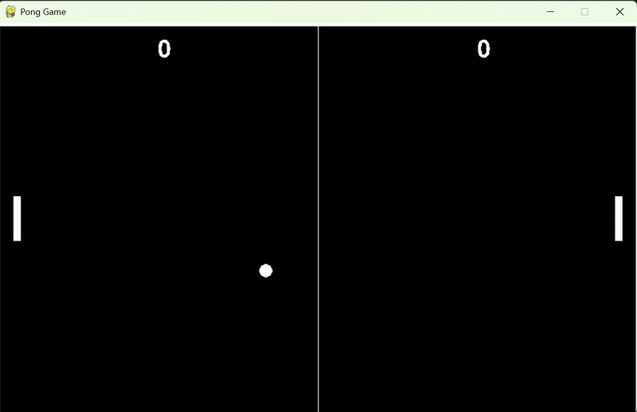

# PongGame-Pygame


Welcome to **PongGame-Pygame** — a classic Pong game recreated from scratch in Python using the powerful [Pygame](https://www.pygame.org/) library.

Pong is a timeless arcade sports video game, inspired by table tennis, originally created by Atari and first released in 1972. This project captures the simplicity and fun of the original game, featuring two paddles, a bouncing ball, and competitive gameplay.

---

## Features

- Classic 2D Pong gameplay  
- Smooth paddle and ball movement  
- Score tracking for both players  
- Easy-to-understand Python and Pygame code — great for learning  

---

## Setup & Installation

Before running the game, you need to install the Pygame library. Choose the command based on your operating system:

### Windows
```bash
pip install pygame
```

### macOS
```bash
pip3 install pygame
```

### Linux
```bash
pip3 install pygame
```

---

## How to Run

1. Clone this repository or download the source code.  
2. Open your terminal or command prompt and navigate to the project folder.  
3. Run the game with:
   ```bash
   python Pong0_Main.py
   ```  
   
---

## Controls

- Player 1: Use **W** (up) and **S** (down) keys  
- Player 2: Use **Up Arrow** and **Down Arrow** keys  

---

## Demo



---

## Contribution

Feel free to fork the project and submit pull requests! Whether it’s improving gameplay, adding new features, or fixing bugs — contributions are welcome.

---

Enjoy playing Pong! 🏓
